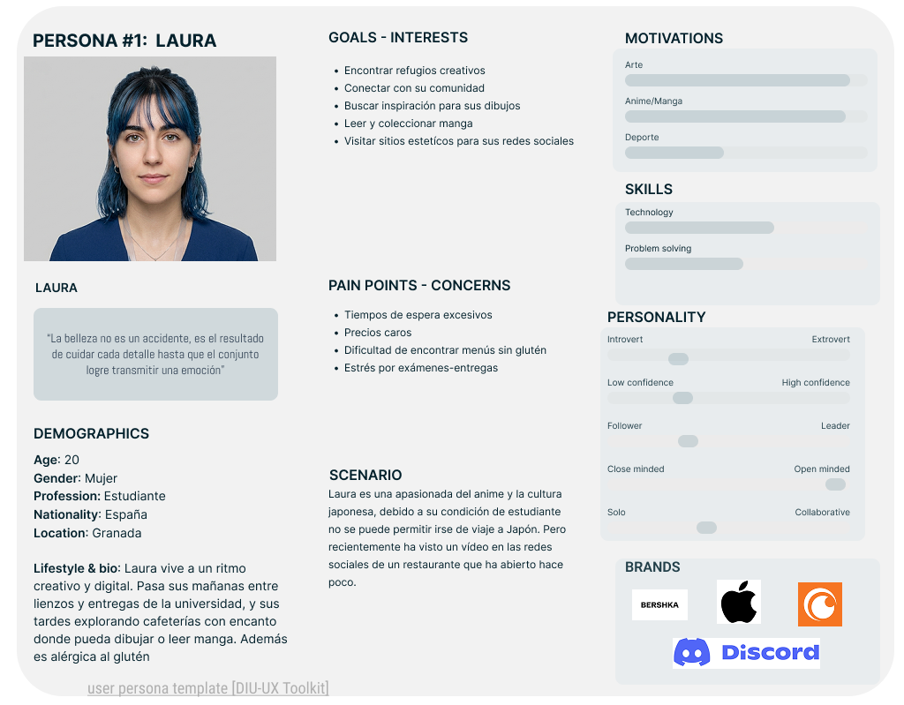
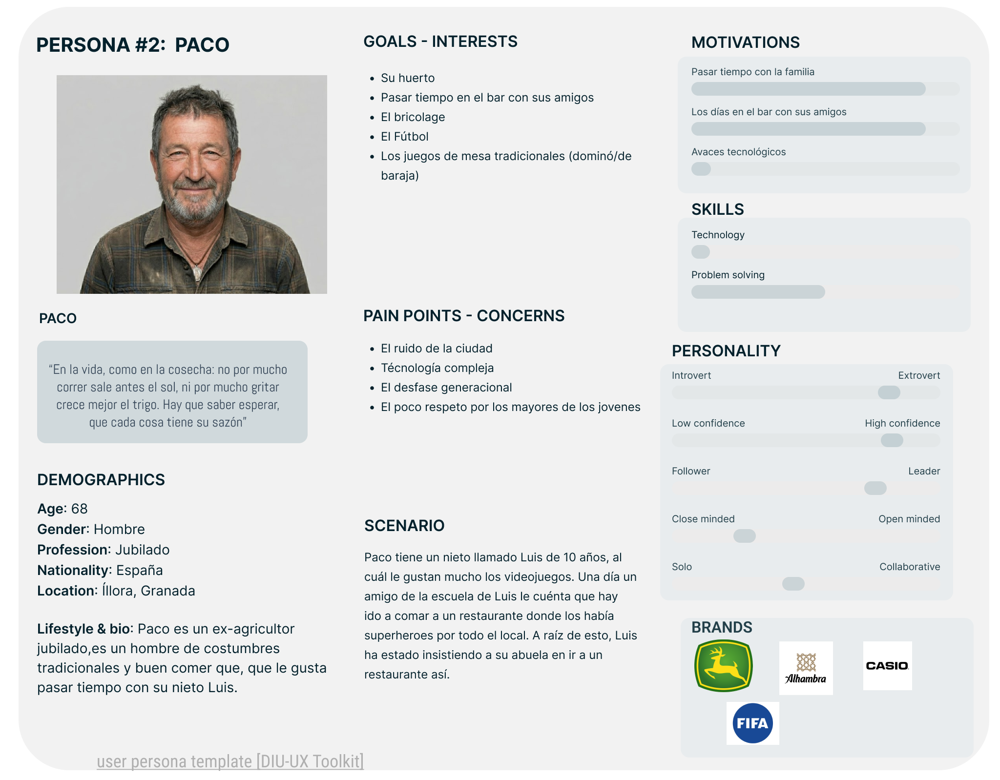
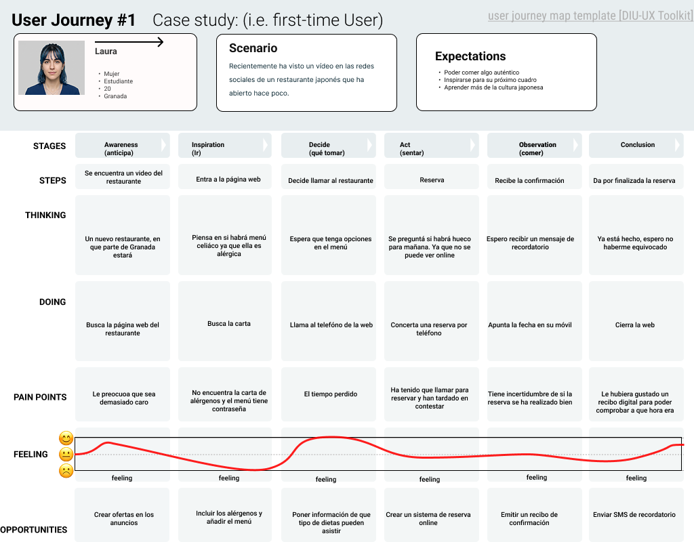
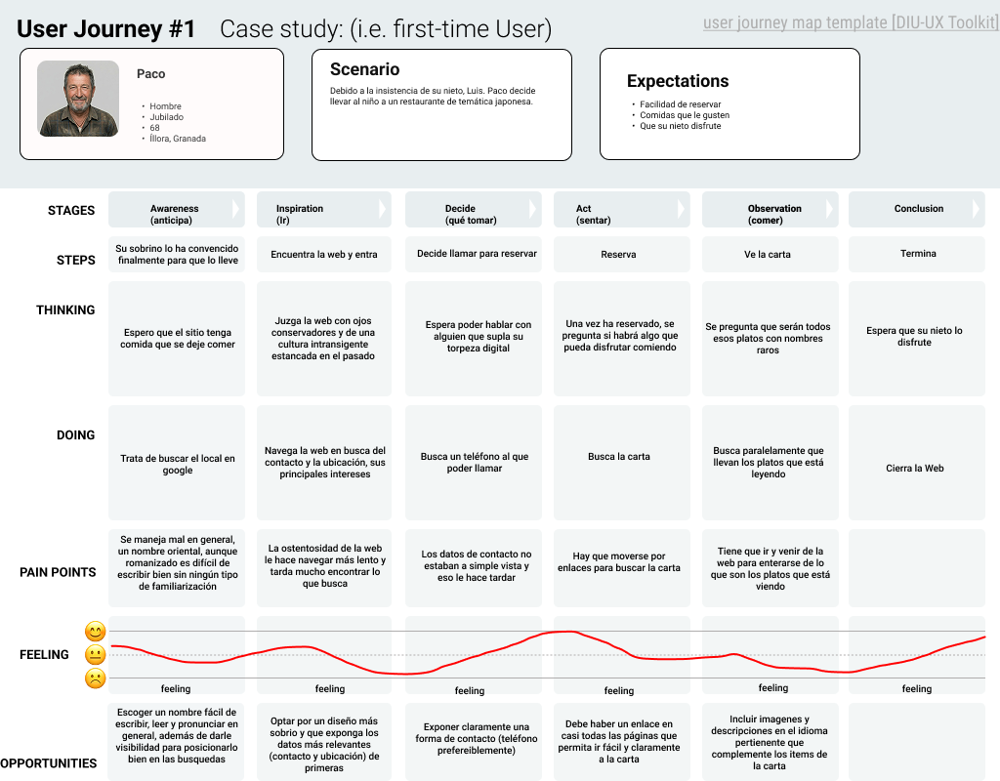

# DIU26
Prácticas Diseño Interfaces de Usuario (Tema: .... ) 

* [Guiones de prácticas](GuionesPracticas/)
* [Guía para crea tu Case Study](Guia_CaseStudy.md)
* Sala de la Fama [DIU Hall of fame](https://github.com/mgea/DIU/tree/master/hall_of_fame) donde se pueden encontrar Case Study destacados de otros años.

Actualizado: 14/01/2026

## Paso 0 My UX-Case Study
 
-----

Grupo: DIU1_MIDAS.  Curso: 2025/26 

Nombre del Proyecto: 

>>> Decida el nombre corto de su propuesta en la práctica 2 

Descripción: 

>>> Describa la idea de su producto en la práctica 2 

Logotipo: 

>>> Si diseña un logotipo para su producto en la práctica 3 pongalo aqui, a un tamaño adecuado. Si diseña un slogan añadalo aquí

Miembros y nombre del equipo:
 * :bust_in_silhouette:  Minerva Cebrián Marín   :octocat: https://github.com/mine1712    
 * :bust_in_silhouette:  Daniel Vega Jiménez     :octocat: https://github.com/DeltaCeleste

----- 

 

# Proceso de Diseño 

 

## Paso 1. UX User & Desk Research & Analisis 

### 1.a User Reseach Plan
-----
Este proyecto investiga la intersección entre la gastronomía japonesa y el universo de la **cultura pop japonesa**. Nuestra estrategia se basa en un análisis competitivo de nuestro competidor **"Ramen Shifu''**, una gran cadena de restaurantes multinacional a nivel europeo y un **User Journey Map** basado en perfiles de **usuarios ficticios** contrastantes entre sí para identificar debilidades críticas de nuestros competidores. De manera adicional se desarrollará un **Usability Review** para exponer concretamente todas las áreas que presenten problemas de usabilidad.

El objetivo es diseñar una interfaz que vaya más alla de la mera transacción, convirtiéndose en una herramienta estratégica de retención y optimización del servicio. Buscamos validar qué atributos específicos influyen en la experiencia del usuario. De este modo, lograremos capitalizar las carencias detectadas en nuestros competidores y posicionar nuestra plataforma como una solución superior, atractiva y altamente funcional para cualquier tipo de usuario.

[Enlace al pdf](P1/1.UserResearchPlan/URP.pdf)

### 1.b Competitive Analysis
-----

Para el análisis de competidores hemos escogido a tres competidores:
- **Shifu Ramen**: Nuestro competidor principal y una cadena con una gran cantidad de restaurantes repartidos por la pen´ınsula con una web cuanto menos curiosa. 
- **Buga Ramen**: Una opción con varios locales por toda Espa˜na que destaca mucho por su decoración.
- **Utopia Ramen**: El más pequeño de los tres, con apenas dos restaurantes pero con un estilo más diferenciado y profesional.
Los tres son restaurantes de la temática que investigamos pero presentan ciertas diferencias entre sí que los hace rentables de analizar. Shifu, siendo el más grande, es el que tiene una página más trambótica, una elección de colores algo cuestionable y alguna decisión de diseño desastrosa como tener un enlace a la carta en la página principal que lleva a una página que solicita una contraseña. En contraposición, Utopia Ramen presenta un diseño más limpio pulido e innovador pero que puede pecar de poco intuitivo, Buga se alza como un medio camino entre ambas, suficientemente intuitiva y bonita, aunque luego palidece en otros apartados como en no tener opción para reservas online.
Como criterios para comparar las páginas hemos escogido:
- *Reserva Online*: Si la página ofrece un sistema para reservar.
- *Ofertas para diferentes dietas*: Si en la página constan optativas para dietas vegetarianas, celiacas...
- *Redes Sociales*: Valora la existencia de enlaces a las redes sociales del restaurante.
- *Soporte Multilingüe*: Enfatiza la posibiliadad de navegar la web en otros idiomas para mejorar su accesibilidad.
- *Rendimiento Web*: Juzga la optimización de la página web de cara a la fluidez.
- *Protección de datos*: Analiza la información que dispone la página de cara a la protección de datos.
- *Contacto*: Califica la forma que la página dispone para ofrecer comunicación con el sitio.
- *Sistema de división y navegación de la carta*: Valora opciones que faciliten navegar la carta.
- *Ubicación y Mapa*: Señala la forma en la que la página facilita la información relativa a la ubicación.
- *Interfaz Intuitiva*: Valora la intuitividad de la interfaz.
- *Responsive*: Expone la adptatividad de la web, por ejemplo, al visitarla desde el móvil.
- *Accesividad*: Puntua que tan bien se haya adaptado la página para personas con limitaciones.

[Enlace al pdf](P1/2.CompetitorAnalysis/Competitor_Analysis.pdf)
### 1.c Personas 
-----
Para nuestro análisis de persona hemos creado dos personas con perfiles muy diferentes, estos son Laura y Paco. 
- Laura es una estudiante joven de Bellas Artes, la cuál esta familiarizada con la temática anime y japonesa, y además es usuaria habitual de este tipo de restaurantes. 
- Por otro lado tenemos a Paco, un perfil muy diferente el cuál no está interesado en la temática. Pero debido a su nieto va a visitar nuestro restaurante.

### 1.d User Journey Map 
----
Hemos optado por estos casos para explorar a fondo la rutina típica en este tipo de webs, buscar una opción de reserva o de contacto, buscar la ubicación y explorar la carta; pero visto con el contraste que nuestros perfiles presentan. Nos centramos especialmente en los problemas y dificultades que ambos podrían encontrar navegando por estas páginas y en como podría solucionarse.

### 1.e Usability Review 
----
- Puntuación: 68/100 - Moderate
- La puntuación obtenida está más que justificada pues la página que hemos analizado tiene varias carencias destacables. Aún así dispone de suficientes servicios y fortalezas para mantenerse a flote, lo que hace que la puntuación no sea más baja.
[Enlace al pdf](P1/5.UsabilityReview/ur.pdf)
### 1.f Briefing
----
Como bien comentamos en el User Research Planning, en este proyecto hemos realizado un análisis de la intersección de la cultura pop japonesa y la gastronomía japonesa, tomando como referencia el restaurante bar **Ramen Shifu**. Tras realizar esta evaluación, hemos determinado que, aunque los principales competidores presentan una web bien estructurada, encontramos detalles en los que Ramen Shifu muestra una superioridad y viceversa.

Nuestro Usability Review nos dió una puntuación de **68/100**, pudiendo destacar como debilidades principales el uso de sistemas externos para reservas, la inexistencia de filtros de búsqueda o el propio diseño de la interfaz el cuál puede llegar a ser confuso por la distribución y colores. De manera complementaria, hemos realizado dos perfiles de personas ficticias dispares, una joven con interés en la cultura pop japonesa y un señor con ningún tipo de conocimiento sobre esta pero con un nieto que si muestra interés. A partir de estos hemos elaborado casos de accesos a páginas de este tipo de restaurantes, centrándonos en las diversas dificultades que podrían encontrar nuestras personas navegando por estas. De esta forma nos concienciamos de los errores típicos para tratar de no cometerlos.

Por estas razones, nuestra propuesta es la de diseñar una interfaz visualmente agradable y manejable para cualquier tipo de persona, que permita usar filtros de buscado sobre todo para aquellos con dietas especiales. Así mismo, apuntamos a un sistema de reservas único y estandarizado que no de pie a confusiones ni dependencias de servicios externos.

[Enlace al pdf](P1/6.Briefing/Briefing.pdf)

 

## Paso 2. UX Design  

>>> Cualquier título puede ser adaptado. Recuerda borrar estos comentarios del template en tu documento

### 2.a Reframing / IDEACION: Feedback Capture Grid / EMpathy map 
 
----

>>> Comenta con un diagrama los aspectos más destacados a modo de conclusion de la práctica anterior. De qué carece la competencia?? Tu diagrama puede ser una figura subida a la carpeta P2/

 Interesante | Críticas     
| ------------- | -------
  Preguntas | Nuevas ideas
  
    
>>> Explica el Problema y plantea una hipótesis. Es decir, explica aquí qué 
>>> se plantea como "propuesta de valor" para un nuevo diseño de aplicación propio

### 2.b ScopeCanvas

----

>>> Propuesta de valor, pero ahora en vez de un texto es un ScopeCanvas que has subido a P2/ y enlazado desde aqui. Tambien vale una imagen miniatura del recurso.
>>> No olvides que tu propuesta ya tiene un nombre corto y puedes actualizar la cabecera de este archivo

### 2.b User Flow (task) analysis 
 
-----

>>> Definir "User Map" y "Task Flow" ... enlazar desde P2/ y describir brevemente

### 2.c IA: Sitemap + Labelling 
 
----

>>> Identificar términos para diálogo con usuario (evita el spanglish) y la arquitectura de la información. Es muy apropiado un diagrama tipo sitemap y una tabla que se ampliaría para llevar asociado la columna iconos (tanto para la web como para una app). 

Término | Significado     
| ------------- | -------
  Login  | acceder a plataforma

### 2.d Wireframes
 
-----

>>> Plantear el diseño del layout para Web/movil (organización y simulación). Describa la herramienta usada 

 

## Paso 3. Mi UX-Case Study (diseño)

>>> Cualquier título puede ser adaptado. Recuerda borrar estos comentarios del template en tu documento

### 3.a Moodboard

-----

>>> Diseño visual con una guía de estilos visual (moodboard) 
>>> Incluir Logotipo. Todos los recursos estarán subidos a la carpeta P3/
>>> Explique aqui la/s herramienta/s utilizada/s y el por qué de la resolución empleada. Reflexione ¿Se puede usar esta imagen como cabecera de Instagram, por ejemplo, o se necesitan otras?

### 3.b Landing Page
 
----

>>> Plantear el Landing Page del producto. Aplica estilos definidos en el moodboard

### 3.c Guidelines
 
----

>>> Estudio de Guidelines y explicación de los Patrones IU a usar 
>>> Es decir, tras documentarse, muestre las deciones tomadas sobre Patrones IU a usar para la fase siguiente de prototipado. 

### 3.d Mockup
 
----

>>> Consiste en tener un Layout en acción. Un Mockup es un prototipo HTML que permite simular tareas con estilo de IU seleccionado. Muy útil para compartir con stakeholders

 

## Paso 4. Pruebas de Evaluación 

### 4.a Reclutamiento de usuarios 

-----

>>> Breve descripción del caso asignado (llamado Caso-B) con enlace al repositorio Github
>>> Tabla y asignación de personas ficticias (o reales) a las pruebas. Exprese las ideas de posibles situaciones conflictivas de esa persona en las propuestas evaluadas. Mínimo 4 usuarios: asigne 2 al Caso A y 2 al caso B.

| Usuarios | Sexo/Edad     | Ocupación   |  Exp.TIC    | Personalidad | Plataforma | Caso
| ------------- | -------- | ----------- | ----------- | -----------  | ---------- | ----
| User1's name  | H / 18   | Estudiante  | Media       | Introvertido | Web.       | A 
| User2's name  | H / 18   | Estudiante  | Media       | Timido       | Web        | A 
| User3's name  | M / 35   | Abogado     | Baja        | Emocional    | móvil      | B 
| User4's name  | H / 18   | Estudiante  | Media       | Racional     | Web        | B 

### 4.b Diseño de las pruebas 
 
-----

>>> Planifique qué pruebas se van a desarrollar. ¿En qué consisten? ¿Se hará uso del checklist de la P1?

### 4.c Cuestionario SUS
 
----

>>> Como uno de los test para la prueba A/B testing, usaremos el **Cuestionario SUS** que permite valorar la satisfacción de cada usuario con el diseño utilizado (casos A o B). Para calcular la valoración numérica y la etiqueta linguistica resultante usamos la [hoja de cálculo](https://github.com/mgea/DIU19/blob/master/Cuestionario%20SUS%20DIU.xlsx). Previamente conozca en qué consiste la escala SUS y cómo se interpretan sus resultados
http://usabilitygeek.com/how-to-use-the-system-usability-scale-sus-to-evaluate-the-usability-of-your-website/)
Para más información, consultar aquí sobre la [metodología SUS](https://cui.unige.ch/isi/icle-wiki/_media/ipm:test-suschapt.pdf)
>>> Adjuntar en la carpeta P4/ el excel resultante y describa aquí la valoración personal de los resultados 

### 4.d A/B Testing
 
-----

>>> Los resultados de un A/B testing con 3 pruebas y 2 casos o alternativas daría como resultado una tabla de 3 filas y 2 columnas, además de un resultado agregado global. Especifique con claridad el resultado: qué caso es más usable, A o B?

### 4.e Aplicación del método Eye Tracking 

----

>>> Indica cómo se diseña el experimento y se reclutan los usuarios. Explica la herramienta / uso de gazerecorder.com u otra similar. Aplíquese únicamente al caso B.

  
>>> Cambiar esta img por una de vuestro experimento. El recurso deberá estar subido a la carpeta P4/  

>>> gazerecorder en versión de pruebas puede estar limitada a 3 usuarios para generar mapa de calor (crédito > 0 para que funcione) 

### 4.f Usability Report de B
 
-----

>>> Añadir report de usabilidad para práctica B (la de los compañeros) aportando resultados y valoración de cada debilidad de usabilidad. 
>>> Enlazar aqui con el archivo subido a P4/ que indica qué equipo evalua a qué otro equipo.

>>> Complementad el Case Study en su Paso 4 con una Valoración personal del equipo sobre esta tarea

 

## Paso 5. Exportación y Documentación 

### 5.a Exportación a HTML/React
 
----

>>> Breve descripción de esta tarea. Las evidencias de este paso quedan subidas a P5/

### 5.b Documentación con Storybook

----

>>> Breve descripción de esta tarea. Las evidencias de este paso quedan subidas a P5/

 

## Conclusiones finales & Valoración de las prácticas

>>> Opinión FINAL del proceso de desarrollo de diseño siguiendo metodología UX y valoración (positiva /negativa) de los resultados obtenidos. ¿Qué se puede mejorar? Recuerda que este tipo de texto se debe eliminar del template que se os proporciona 

